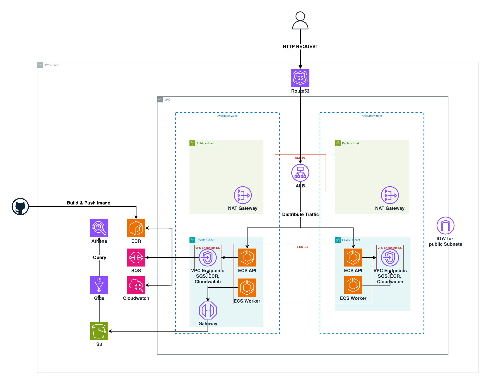

# Supercent 로그 수집 파이프라인

수천만 글로벌 유저의 게임에서 발생하는 **초당 수만 건의 인게임 로그**를 유실 없이 받고 저장하는 파이프라인입니다. **Docker**를 사용하여 API, Worker서비스를 컨테이너화하였고, 그 뒤의 적재 인프라를 **큐(SQS) + DB(MongoDB)** 구조로 설계했습니다.

(`docker compose up --build`)로 다른 환경에서도 동일하게 실행 가능

---

## 아키텍처 (로컬 / docker-compose)

| 컴포넌트 | 역할 | 이미지 |
|---|---|---|
| **api** | `POST /api/v1/logs` 수신 → 검증 → SQS 전송 (호스트 `:3000` 개방) | Node.js / Express |
| **worker** | SQS 폴링 → MongoDB 적재, 실패 시 DLQ로 격리 | Node.js |
| **localstack** | 로컬에서 AWS SQS를 모사 | localstack |
| **queue-init** | 기동 시 메인 큐 + DLQ + redrive policy 생성 (1회성) | amazon/aws-cli |
| **mongodb** | 로그 최종 적재소 (볼륨으로 영속화) | mongo |

---

## 선택 이유 (Rationale)

로그 적재 방식으로 **큐(Queue, B안) + DB(C안) 조합**을 선택했습니다. 인프라 엔지니어 관점의 이유는 다음과 같습니다.

### 1. SQS를 쓴 이유 — *트래픽 흡수 + 디커플링*

- **SQS**를 쓴 첫번째 이유는 트래픽 흡수입니다. 초당 수만건의 로그 요청이 있을 시, **SQS가 없으면 요청들이 바로 DB로 가기 때문에** DB가 과부하가 올 가능성이 매우 높습니다. 또한, **DB 처리량보다, 요청 수가 더 많을 시에는 백로그**가 발생합니다. 그러면 API Latency (P99 / p95 ) 급증하게 되고 응답시간이 매우 느려집니다.
- 반면, SQS가 DB 앞단에 있으면, API 에서 **SQS에 `PUT` Message를 넣고 200**을 응답합니다. SQS는 DB가 못하는 백로그를 흡수를 할 수 있으므로 수만개의 요청들을 대기열에 쌓을 수 있습니다. **Worker는 비동기 처리로 디커플링**하여, API 서비스와 Worker 서비스를 나누어서 Worker서비스는 API 요청시간에 포함이 되지 않습니다. API Latency 응답 속도와, DB 적재가 초과되면 데이터 유실이 발생하지만 SQS를 사용하면 데이터 유실, 트래픽 흡수 그리고 디커플링까지 해결을 해주기 때문에 SQS를 사용하였습니다.
- SQS를 쓰는 이유는 **AWS 관리형 서비스**이기 때문입니다. 또한 이미 DLQ가 이미 SQS안에 있어서 데이터 유실 걱정이 없고 관리하기가 매우 편리합니다. 클라우드로 마이그레이션 할 시에는 **SQS Endpoint env코드만 제거해주면 localstack에서 AWS SQS**로 가기 때문입니다. 반면, Kafka같은 큐 + 저장소를 사용하는 것은 비효율적이라는 판단을 하였습니다. Kafka는 직접 클러스터를 생성을 하여서 직접 관리를 하기 때문에 이번 과제같이 간단한 로그를 큐에 적재하고 DB로 보내는 과정에서는 SQS가 맞다고 판단했습니다.

### 2. 왜 SQS에서 멈추지 않고 MongoDB를 배치한 이유

- 큐는 저장소가 아니라 디커플링을 통해 로그 메세지 비동기 처리를 도와주는 도구입니다. 특정 시간이 지나면 로그는 사라지므로, **장기간 보관에는 큐만 배치하는 것은 절대 안전하지 않다**고 판단하였습니다. 그리하여 DB를 끝에 두고 데이터 유실을 없애고, 데이터 영속성도 유지를 하였습니다.
- **MongoDB를 쓴 이유는 Document Type DB**였기 때문입니다. JSON 형태로 저장하기에는 MongoDB가 최적화라 생각하여 MongoDB를 썼습니다.

### 3. AWS에서 MongoDB 대신 S3 쓰는 이유

- **로컬**은 빠른 개발·검증에 적합한 **MongoDB(Document Type DB)** 로 적재합니다.
- **AWS 아키텍처 설계**(선택 과제)에서는 MongoDB보다는 로그 적재에 최적화된 대표 로그 스토리지 **S3**를 적재소로 사용합니다. 

---

## 실행 가이드

### 사전 요구 사항

- Docker / Docker Compose (v2)

### 1) 전체 환경 기동

프로젝트 루트에서 아래 한 줄이면 됩니다.

```bash
docker compose up --build
```

- 최초 실행 시 `api` / `worker` 이미지가 빌드되고, `localstack` → `queue-init`(큐+DLQ 생성)  → `api` / `worker` 순서로 의존성에 맞춰 기동됩니다.
- 백그라운드로 띄우려면: `docker compose up --build -d`
- 기동 상태 확인: `docker compose ps` (localstack/mongodb/api가 `healthy`가 되면 준비 완료)

### 2) 종료

```bash
docker compose down          # 컨테이너 정리 (볼륨 유지)
docker compose down -v       # 볼륨까지 완전 삭제
```

## 검증 결과

아래는 실제로 기동 후 로그를 전송하고 인프라에 도달했음을 확인한 과정입니다.

### 1. 정상 로그 적재

**1. 로그 전송 (curl):**

```bash
curl -X POST http://localhost:3000/api/v1/logs \
  -H "Content-Type: application/json" \
  -d '{"event":"login","userId":123,"coins":500}'
```

**응답 (200 OK):**

```json
{"message":"Log data sent to SQS successfully.","messageId":"44823cb7-c202-4bbd-8863-84c7ebc26811"}
```

**2. Worker 처리 로그:**

```bash
docker compose logs worker | tail
```

```
Connected to MongoDB: supercent.logs
Message processed: 44823cb7-c202-4bbd-8863-84c7ebc26811
```

**3. MongoDB 적재 확인:**

```bash
docker exec supercent-mongodb mongosh --quiet supercent \
  --eval 'db.logs.find().sort({storedAt:-1}).limit(1)'
```

```js
[
  {
    _id: ObjectId('...'),
    messageId: '44823cb7-c202-4bbd-8863-84c7ebc26811',
    receivedAt: '2026-07-12T08:15:30.812Z',
    payload: { event: 'login', userId: 123, coins: 500 },
    storedAt: ISODate('2026-07-12T08:15:30.905Z')
  }
]
```

→ 전송한 로그가 큐를 거쳐 DB까지 **유실 없이 도달**함을 확인.

### 2. 유실 방지(DLQ) 검증

처리에 계속 실패하는 메시지가 버려지지 않고 DLQ로 격리되는지 확인합니다.

**메시지를 큐에 직접 투입:**

```bash
docker exec supercent-localstack awslocal sqs send-message \
  --queue-url http://localhost:4566/000000000000/supercent-queue \
  --message-body 'this-is-not-json{'
```

```bash
worker-1              | Failed to process message: SyntaxError: Unexpected token 'h', "this-is-not-json{" is not valid JSON
worker-1              |     at JSON.parse (<anonymous>)
worker-1              |     at processMessage (/app/worker.js:9:23)
worker-1              |     at startWorker (/app/worker.js:35:19)
worker-1              |     at process.processTicksAndRejections (node:internal/process/task_queues:95:5)
```

**5회 재시도 후 DLQ 적재 확인** :

```bash
# DLQ에 쌓인 메시지 개수 확인
docker exec supercent-localstack awslocal sqs get-queue-attributes \
  --queue-url http://localhost:4566/000000000000/supercent-queue-dlq \
  --attribute-names ApproximateNumberOfMessages

```

```bash
# DLQ 쌓인 메세지 결과
docker exec supercent-localstack awslocal sqs get-queue-attributes \
  --queue-url <http://localhost:4566/000000000000/supercent-queue-dlq> \
  --attribute-names ApproximateNumberOfMessages
{
    "Attributes": {
        "ApproximateNumberOfMessages": "5"
    }
}
```

```bash
# DLQ 메시지 내용 + 수신 횟수(ApproximateReceiveCount) 확인
docker exec supercent-localstack awslocal sqs receive-message \
  --queue-url http://localhost:4566/000000000000/supercent-queue-dlq \
  --attribute-names ApproximateReceiveCount --visibility-timeout 0
```

```bash
## DLQ 수신 횟수 결과
{
    "Messages": [
        {
            "MessageId": "9842af67-1fee-4ef4-afe1-783e2e9b1734",
            "ReceiptHandle": "ZDJhZGQ1N2ItZWYzNC00OWMxLWFjMGEtYzk1ZjM2MGQ1MzQ1IGFybjphd3M6c3FzOmFwLW5vcnRoZWFzdC0yOjAwMDAwMDAwMDAwMDpzdXBlcmNlbnQtcXVldWUtZGxxIDk4NDJhZjY3LTFmZWUtNGVmNC1hZmUxLTc4M2UyZTliMTczNCAxNzgzOTEwMTMwLjM0MzQzMzQ=",
            "MD5OfBody": "9543188a9f7b491705c9c6be37f394c7",
            "Body": "this-is-not-json{",
            "Attributes": {
                "ApproximateReceiveCount": "6"
            }
            }
        }
    ]
}

```

**결과:**

```bash
- Worker 로그: "Failed to process message: SyntaxError ..." 5회 반복 (삭제하지 않음)
- 메인 큐 ApproximateNumberOfMessages: 0   (메시지가 빠져나감)
- DLQ ApproximateNumberOfMessages: 5        (격리 성공)
- DLQ 메시지 ApproximateReceiveCount: 6      (maxReceiveCount=5 초과 → 자동 이동)
```
---

## 프로젝트 구조

```
.
├── api/                    # 로그 수집 API 서버 (Express)
│   ├── routes/logs.js      #   POST /api/v1/logs 핸들러 (검증 + SQS 전송)
│   ├── services/sqs.js     #   SQS SendMessage
│   ├── server.js           #   /healthz, JSON 파싱, 에러 핸들러
│   └── Dockerfile
├── worker/                 # SQS 소비 → MongoDB 적재 워커
│   ├── services/sqs.js     #   ReceiveMessage / DeleteMessage
│   ├── db/mongo.js         #   MongoDB insert
│   ├── worker.js           #   폴링 루프 (실패 시 미삭제 → 재처리/DLQ)
│   └── Dockerfile
├── scripts/init-sqs.sh     # 큐 + DLQ + redrive policy 초기화
├── docker-compose.yml      # 전체 인프라 정의
├── terraform/              # (선택 과제) AWS IaC
└── README.md
```

---

## 선택 과제: AWS 인프라 설계 + Terraform

### 아키텍처 개요



### 포함 요소

- **네트워크**: VPC(`10.20.0.0/16`), **Multi AZ**를 활용한 Public/Private Subnet, IGW, **AZ별 NAT Gateway**, 라우팅 테이블
- **VPC Endpoint**: S3 Gateway Endpoint와 ECR API, ECR Docker Registry, SQS, CloudWatch Logs Interface Endpoint를 구성하여 Private Subnet의 ECS Fargate 태스크가 이미지 pull, 큐 처리, 로그 전송, S3 적재 시 NAT Gateway를 거치지 않고 AWS 내부 네트워크 경로로 통신
- **ALB를 통한 부하분산**: 퍼블릭 **ALB** 에서 Multi AZ Private Subnet의 ECS API 태스크로 분산
- **ECR, ECS (Docker Registry & Service)**: **ECS Fargate** API 서비스(오토스케일 2~10) + Worker 서비스(오토스케일 2~20), **ECR** 이미지 저장소
- **로그 적재**: **SQS**를 활용하여 디커플링 및 비동기 처리 후 **S3**(raw logs)에 JSON log 적재. 그 다음 **Glue Data Catalog** 을 통해서 스키마로 변환 후 **Athena** 에서 로그 분석 기능
- **보안/권한**: 최소 권한 IAM Task Role
- **Monitoring**: CloudWatch Logs (API/Worker, 14일 보존)

### Terraform 구성

| 파일 | 내용 |
|---|---|
| `network.tf` | VPC, Subnet, IGW, NAT, 라우팅, VPC Endpoint |
| `ecs.tf` | ALB, ECS 클러스터/서비스/태스크 정의 |
| `ecs_autoscaling.tf` | API/Worker 오토스케일링 |
| `security.tf` | 보안 그룹 |
| `iam.tf` | Task 실행/권한 Role |
| `log_storage.tf` | SQS, DLQ, S3, Glue, Athena |
| `ecr.tf` | 컨테이너 이미지 저장소 |
